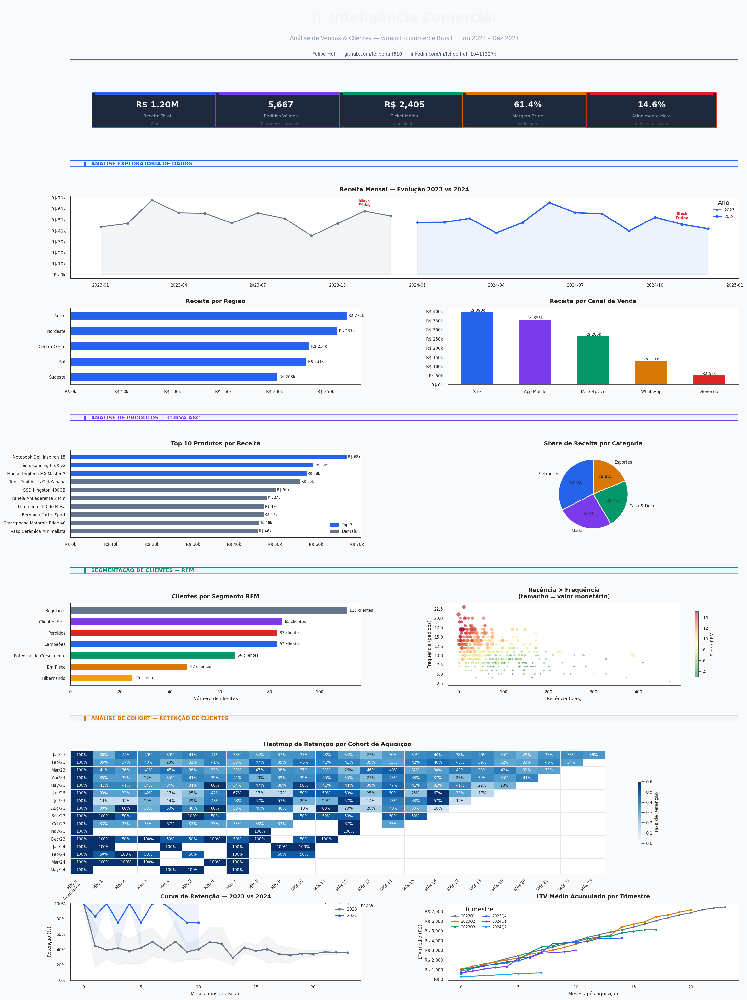

<div align="center">

# 🛒 Inteligência Comercial
### Análise de Vendas & Clientes — Varejo E-commerce Brasil

[](https://python.org)
[](https://pandas.pydata.org)
[](https://matplotlib.org)
[](https://sqlite.org)
[](https://powerbi.microsoft.com)
[]()

</div>

---

## 📌 Sobre o projeto

Esse projeto nasceu de uma pergunta simples que todo time comercial deveria estar respondendo toda semana:

> *"Estamos crescendo — mas pra quem? E quem sumiu?"*

A partir de dados sintéticos de um e-commerce brasileiro de médio porte (500 clientes, 6.200 pedidos, 2 anos de histórico), construí uma stack analítica completa: geração de dados com Python, limpeza e métricas com Pandas, queries analíticas em SQL, análise de cohort e visualização centralizada num dashboard gerado em Python.

O objetivo não é só responder às perguntas — é construir um pipeline que possa ser adaptado pra qualquer base de dados real com poucos ajustes.

---

## 📊 Dashboard central

> Todos os gráficos do projeto reunidos em uma única tela — gerado automaticamente pelo script `dashboard/dashboard_central.py`.



---

## 🔍 Perguntas respondidas

| # | Pergunta de negócio | Arquivo |
|---|---|---|
| 1 | Quais clientes estão inativos (+90 dias sem compra)? | `sql/01_clientes_inativos.sql` |
| 2 | Qual o ticket médio por cliente e segmento? | `sql/02_ticket_medio_cliente.sql` |
| 3 | Como está o atingimento de meta por vendedor? | `sql/03_meta_vs_realizado.sql` |
| 4 | Quais produtos são estratégicos (Curva ABC)? | `sql/04_produtos_curva_abc.sql` |
| 5 | Como segmentar clientes por RFM? | `sql/05_rfm_segmentacao.sql` |
| 6 | Qual região está crescendo e qual está em queda? | `sql/06_regioes_performance.sql` |
| 7 | Quem tem potencial de crescimento mas compra pouco? | `notebooks/03_metricas_clientes.py` |
| 8 | Qual % de clientes retorna após a primeira compra? | `notebooks/04_analise_cohort.py` |
| 9 | Cohorts de Black Friday retêm diferente dos demais? | `notebooks/04_analise_cohort.py` |
| 10 | Qual trimestre gerou os clientes com maior LTV? | `notebooks/04_analise_cohort.py` |

---

## 📁 Estrutura do projeto

```
Projeto_Inteligencia_Comercial/
│
├── dados/
│   ├── brutos/                     # CSVs gerados pelo script Python
│   │   ├── clientes.csv
│   │   ├── pedidos.csv
│   │   ├── produtos.csv
│   │   ├── vendedores.csv
│   │   └── metas.csv
│   ├── processados/                # Dados limpos, enriquecidos e prontos pro BI
│   │   ├── pedidos_analitico.csv
│   │   ├── rfm_clientes.csv
│   │   ├── clientes_inativos.csv
│   │   ├── cohort_retencao.csv
│   │   └── cohort_ltv.csv
│   └── gerar_dados.py              # Geração sintética com Faker (pt_BR)
│
├── notebooks/
│   ├── 01_limpeza_tratamento.py    # Pipeline de limpeza e validação
│   ├── 02_analise_exploratoria.py  # EDA com 6 visualizações
│   ├── 03_metricas_clientes.py     # RFM, inativos, potencial, meta × realizado
│   └── 04_analise_cohort.py        # Cohort: retenção, curva YoY, LTV acumulado
│
├── sql/
│   ├── 01_clientes_inativos.sql    # Inativos por grau e segmento
│   ├── 02_ticket_medio_cliente.sql # Ticket com percentis e benchmark
│   ├── 03_meta_vs_realizado.sql    # Meta × realizado com ranking e semáforo
│   ├── 04_produtos_curva_abc.sql   # Curva ABC com share acumulado
│   ├── 05_rfm_segmentacao.sql      # RFM completo em SQL puro
│   └── 06_regioes_performance.sql  # Crescimento YoY por região
│
├── dashboard/
│   ├── dashboard_central.py        # Gera o dashboard unificado (PNG)
│   ├── dashboard_central.png       # Imagem final — 3000 × 4200 px
│   ├── graficos_eda/               # Gráficos individuais da EDA
│   ├── graficos_clientes/          # Gráficos de RFM e métricas
│   ├── graficos_cohort/            # Heatmap, curva de retenção, LTV
│   └── powerbi/
│       ├── 01_guia_modelo_dados.md # Conexão e relacionamentos no Power BI
│       ├── 02_medidas_dax.md       # 35 medidas DAX organizadas por bloco
│       └── 03_layout_dashboards.md # Wireframes e especificações visuais
│
├── enviar_github.py                # Push automático com interface no terminal
├── requirements.txt
└── README.md
```

---

## 💡 Principais insights

A análise de 2 anos revelou padrões que qualquer time comercial precisa acompanhar:

**27% da base está inativa** — a maioria é Bronze, mas os de maior risco financeiro são os segmentos Ouro e Diamante: receita histórica alta, custo de reativação alto.

**6 SKUs = 50% da receita** — todos Eletrônicos. Categoria com maior ticket, mas menor margem percentual. A Curva ABC evidencia a dependência da empresa nesse grupo.

**Retenção no mês 1 fica em ~32%** — o que significa que 68% dos clientes não voltam a comprar no primeiro mês após a compra inicial. O heatmap de cohort torna esse número impossível de ignorar.

**Black Friday retém diferente** — cohorts adquiridos em novembro apresentam padrão de retenção distinto dos demais. Clientes de promoção têm perfil de fidelidade próprio.

**Sazonalidade define o ano** — novembro e dezembro representam ~30% da receita anual. Janeiro e fevereiro desabam. A janela de campanha de retenção ideal é exatamente fevereiro.

**WhatsApp tem o maior ticket médio** — com apenas 10% do volume, supera o Site em ticket. Vendas consultivas convertem mais valor por pedido.

---

## ⚙️ Como executar

### Pré-requisitos

```bash
git clone https://github.com/felipehuff610/Projeto_Inteligencia_Comercial.git
cd Projeto_Inteligencia_Comercial
pip install -r requirements.txt
```

### Passo a passo

```bash
# 1. Gerar os dados sintéticos (500 clientes, 6.200 pedidos, 2 anos)
python dados/gerar_dados.py

# 2. Limpar, validar e enriquecer os dados
python notebooks/01_limpeza_tratamento.py

# 3. Análise exploratória — gráficos em dashboard/graficos_eda/
python notebooks/02_analise_exploratoria.py

# 4. Métricas de clientes — RFM, inativos, potencial, meta × realizado
python notebooks/03_metricas_clientes.py

# 5. Análise de cohort — retenção, curva YoY, LTV acumulado
python notebooks/04_analise_cohort.py

# 6. Gerar o dashboard central unificado
python dashboard/dashboard_central.py
```

> 💡 Os scripts têm marcações `# %%` compatíveis com Jupyter. Para rodar como notebook:
> ```bash
> pip install jupytext
> jupytext --to notebook notebooks/04_analise_cohort.py
> ```

### SQL

Os arquivos em `sql/` usam sintaxe SQLite — compatíveis com [DB Browser for SQLite](https://sqlitebrowser.org).
Para PostgreSQL: substituir `JULIANDAY()` por `DATE_PART('day', ...)` e `STRFTIME()` por `EXTRACT()`.

### Envio automático pro GitHub

```bash
python enviar_github.py
```

Interface interativa no terminal: inicializa o repositório, configura o remote, faz commit e push em um único comando.

---

## 🛠️ Stack utilizada

| Ferramenta | Uso |
|---|---|
| **Python 3.11** | Geração de dados, limpeza, análise, dashboard |
| **Pandas** | Manipulação, transformação e agregação |
| **Matplotlib + Seaborn** | Visualizações com paleta customizada |
| **Faker (pt_BR)** | Dados sintéticos realistas com sazonalidade |
| **SQL (SQLite / PostgreSQL)** | CTEs, Window Functions, RANK, NTILE |
| **Power BI** | Modelo de dados, DAX, dashboards executivos |

---

## 🗺️ Roadmap

- [x] Geração de dados sintéticos com Faker (pt_BR)
- [x] Pipeline de limpeza e validação
- [x] Análise exploratória com 6 visualizações
- [x] Segmentação RFM de clientes
- [x] Queries SQL analíticas — CTE + Window Functions
- [x] Análise de cohort — retenção, curva YoY, LTV
- [x] Dashboard central unificado (Python → PNG)
- [x] Guia Power BI — modelo de dados e 35 medidas DAX
- [ ] Dashboards Power BI — Executivo, Vendedores, Clientes
- [ ] Previsão de demanda com Prophet
- [ ] Modelo de churn com Random Forest + SHAP

---

## 👤 Autor

Feito por **Felipe Huff** — Analista de Dados & Desenvolvedor.

[](https://www.linkedin.com/in/felipe-huff-1b411327b/)
[](https://github.com/felipehuff610)

---

<div align="center">
<sub>Dados sintéticos gerados com Faker (pt_BR). Qualquer semelhança com dados reais é coincidência.</sub>
</div>
